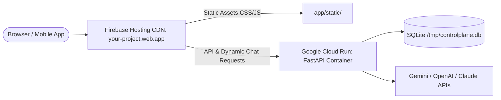

# Deploying ControlPlane AI to Firebase & Google Cloud Run

This guide explains how to deploy the **ControlPlane AI** proxy wrapper (FastAPI backend + Claude-inspired Web UI + SQLite database) onto **Firebase Hosting** backed by **Google Cloud Run**.

---

## 🏗️ Architecture Overview



---

## 📋 Prerequisites

1. **Google Cloud / Firebase Project**:
   Create a project at [console.firebase.google.com](https://console.firebase.google.com/).
2. **Install Google Cloud SDK (`gcloud`) & Firebase CLI**:
   ```bash
   # On macOS via Homebrew:
   brew install google-cloud-sdk
   brew install firebase-cli
   ```
3. **Login to Google / Firebase**:
   ```bash
   gcloud auth login
   firebase login
   ```

---

## 🚀 Quick Automated Deployment

We have created an automated deployment script `deploy_firebase.sh`:

```bash
# Make sure script is executable
chmod +x deploy_firebase.sh

# Run deployment (replace with your Firebase project ID)
./deploy_firebase.sh your-firebase-project-id us-central1
```

---

## 🛠️ Step-by-Step Manual Deployment

### 1. Build and Deploy Container to Google Cloud Run
```bash
gcloud run deploy controlplane-api \
  --source . \
  --project your-firebase-project-id \
  --region us-central1 \
  --platform managed \
  --allow-unauthenticated \
  --set-env-vars "ENVIRONMENT=production,DATABASE_PATH=/tmp/controlplane.db,GEMINI_API_KEY=your_key_here"
```

### 2. Connect Firebase Hosting to Cloud Run
Ensure `firebase.json` has the Cloud Run rewrite:
```json
{
  "hosting": {
    "public": "app/static",
    "rewrites": [
      {
        "source": "**",
        "run": {
          "serviceId": "controlplane-api",
          "region": "us-central1"
        }
      }
    ]
  }
}
```

### 3. Deploy Firebase Hosting
```bash
firebase deploy --only hosting --project your-firebase-project-id
```

---

## 🔑 Setting Provider API Keys in Cloud Run

You can update your API keys securely in Cloud Run anytime:

```bash
gcloud run services update controlplane-api \
  --region us-central1 \
  --set-env-vars "GEMINI_API_KEY=your_gemini_key,OPENAI_API_KEY=your_openai_key"
```

---

## 📱 Accessing from Your Phone

Once deployed, your application is globally available with automatic HTTPS:
👉 **`https://your-firebase-project-id.web.app`**
