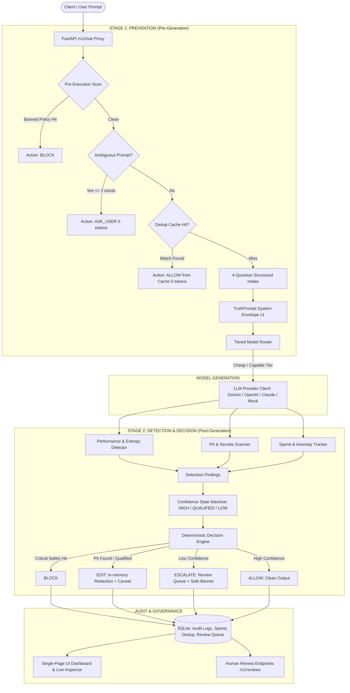

# ControlPlane AI
<p align="center">
  <strong>Deterministic AI Governance, Hallucination Prevention & Cost Control Wrapper</strong>
</p>

<p align="center">
  
  
  
  
  
  
</p>

---

## 🎯 Executive Overview

**ControlPlane AI** is an intelligent proxy and runtime governance engine designed to sit between upstream client applications and downstream LLM APIs (OpenAI, Google Gemini, Anthropic Claude, and local models).

Unlike traditional LLM wrappers that only evaluate text *after* money has been spent and hallucinations have been generated, ControlPlane executes a **strict two-stage pipeline**:

1. **Stage 1 — Prevention (Before Generation)**: 
   - **Structured 4-Question Intake** (Task, Context, Constraints, Expected Output)
   - **Zero-Token Clarification Interceptor** (`ASK_USER` on ambiguous prompts)
   - **TruthPrompt System Envelope** (forces epistemic separation of known facts vs inferences)
   - **Pre-execution PII & Policy Gate** (blocks toxic/banned queries before LLM invocation)
   - **Semantic Deduplication Cache** (serves near-duplicate queries with 0 new tokens)
   - **Tiered Model Routing** (routes simple tasks to `cheap` tier and complex tasks to `capable` tier)

2. **Stage 2 — Detection & Gated Decision (After Generation)**:
   - **Performance & Entropy Detection** (mean logprob uncertainty scan & TruthPrompt self-reported confidence)
   - **Responsibility & Secrets Scan** (dual-pass regex redaction for SSNs, API keys, credit cards, emails, phone numbers)
   - **Spend Velocity & Anomaly Checks** (hourly budget safeguards and cost spike alarms)
   - **3-State Confidence State Machine** (`HIGH` / `QUALIFIED` / `LOW`)
   - **Deterministic Decision Engine** (`BLOCK` ➔ `EDIT` ➔ `ESCALATE` ➔ `ALLOW`)
   - **Human-in-the-Loop Review Queue** (asynchronous resolution + synchronous safe-downgrade caveats)
   - **Full SQLite Audit Trail** (complete end-to-end reproducibility)

---

## 🏗️ Technical Architecture



---

## ⚡ Feature Comparison: ControlPlane AI vs Competitors

| Feature | Generic LLM Wrapper | Standard Guardrails | **ControlPlane AI** |
|---|:---:|:---:|:---:|
| **Pre-Generation Prevention** | ❌ No | ⚠️ Basic regex | ✅ **TruthPrompt + 4-Question Intake** |
| **Ambiguity Interception** | ❌ No | ❌ No | ✅ **Zero-token 4-focus clarification (`ASK_USER`)** |
| **Model Cost Routing** | ❌ Static model | ❌ Static model | ✅ **Rule-based Tiered Routing (`cheap` vs `capable`)** |
| **Exact & Semantic Dedup** | ❌ No | ❌ No | ✅ **Normalized Hash Cache (100% token savings)** |
| **Spend Velocity Safeguards** | ❌ No | ❌ No | ✅ **Hourly spend tracker & spike detector** |
| **Confidence Measurement** | ❌ None | ⚠️ Output score | ✅ **Logprob entropy + TruthPrompt self-rating** |
| **Decision Priority Matrix** | ❌ Pass/Fail | ⚠️ Inflexible rules | ✅ **Strict Deterministic Ladder (`BLOCK` ➔ `EDIT` ➔ `ESCALATE` ➔ `ALLOW`)** |
| **Human Review Workflow** | ❌ None | ⚠️ Webhook only | ✅ **SQLite Review Queue + 1-Click UI Resolution** |
| **Setup Overhead** | ⚠️ High (Cloud DBs) | ⚠️ High (External APIs) | ✅ **Zero-Ops (Single process, SQLite, Pure Vanilla Web UI)** |

---

## 🗄️ Relational Data Contracts & SQLite Schema

```
controlplane.db (SQLite)
├── audit_logs             # Immutable ledger of every request, intake, findings, decision & latency
├── dedup_cache            # Normalized prompt hashes + cached response texts (24h TTL)
├── spend_records          # Fine-grained token usage, estimated USD costs, and timestamps
└── review_queue           # Pending and resolved ESCALATE items with reviewer action/notes
```

### Core Schema Types (`app/core_types.py`)

| Schema | Purpose | Key Attributes |
|---|---|---|
| `IntakeResult` | 4-Question Structured Intake | `task`, `context`, `constraints`, `expected_output`, `source` |
| `TruthPromptEnvelope` | Prompt hardening container | `version`, `known_facts`, `assumptions`, `unknowns`, `intake` |
| `DetectionFindings` | Output scan diagnostics | `performance_score`, `self_rated_confidence`, `is_duplicate`, `spend_anomaly`, `pii_found`, `policy_hits` |
| `ConfidenceResult` | State classification | `state` (`HIGH`, `QUALIFIED`, `LOW`), `reasons` |
| `Decision` | Deterministic action | `action` (`ALLOW`, `EDIT`, `ESCALATE`, `BLOCK`), `reasons`, `edits_applied`, `warning_banner`, `review_id` |
| `ReviewQueueItem` | Human supervision record | `review_id`, `request_id`, `status` (`pending`, `approved`, `rejected`, `edited`), `reviewer_note` |

---

## 🚀 Quick Start

### 1. Prerequisites & Installation

```bash
# Clone the repository
git clone https://github.com/1337dCoder/ControlPlaneAI.git
cd ControlPlaneAI

# Create virtual environment
python3 -m venv .venv
source .venv/bin/activate

# Install dependencies
pip install -r requirements.txt
```

### 2. Environment Setup

```bash
cp .env.example .env
```
Configure `.env` with your API keys:
```env
GEMINI_API_KEY=your_gemini_api_key
OPENAI_API_KEY=your_openai_api_key
ANTHROPIC_API_KEY=your_anthropic_api_key
DATABASE_PATH=controlplane.db
CHEAP_MODEL=gemini-flash-lite-latest
CAPABLE_MODEL=gemini-3.1-pro
```
*(If no API keys are provided, ControlPlane automatically falls back to realistic deterministic mock generation mode).*

### 3. Run Test Suite

```bash
pytest -v
```
*(Runs all 24 automated unit and integration tests across detectors, intake, routing, decisions, providers, and review queue).*

### 4. Launch the Server & UI

```bash
uvicorn app.main:app --reload --port 8000
```
Open **`http://localhost:8000`** in your browser to access the interactive web playground and live reasoning dashboard.

---

## 💻 CLI & Smoke Testing Tools

ControlPlane includes interactive terminal tools for rapid evaluation:

```bash
# Interactive Chat Terminal
python cli.py

# Run Canonical End-to-End Smoke Tests
python cli.py demo
# or: python smoke_test.py

# Inspect Recent SQLite Audit Traces
python cli.py audit 10
```

---

## 📡 REST API Reference

### 1. Send Prompt (`POST /v1/chat`)

```bash
curl -X POST http://localhost:8000/v1/chat \
  -H "Content-Type: application/json" \
  -d '{
    "prompt": "Explain the time complexity of quicksort with examples.",
    "user_id": "eng_team_user"
  }'
```

#### Example Response:
```json
{
  "request_id": "9d8e3c12-4f5a-4b91-8842-12a8b9f01234",
  "content": "[FACTS]: Verified input request for Quicksort...\n[SOLUTION]: Quicksort average case is O(N log N)...",
  "decision": {
    "action": "ALLOW",
    "reasons": ["Confidence is HIGH and no policy/PII violations were detected."],
    "edits_applied": [],
    "warning_banner": null,
    "review_id": null
  },
  "confidence": {
    "state": "HIGH",
    "reasons": ["Strong factual decomposition with verified reasoning"]
  },
  "findings": {
    "performance_score": 0.94,
    "self_rated_confidence": 0.94,
    "is_duplicate": false,
    "spend_anomaly": false,
    "pii_found": [],
    "policy_hits": []
  },
  "intake": {
    "task": "Explain the time complexity of quicksort with examples.",
    "context": "Not specified",
    "constraints": "Strict factual decomposition",
    "expected_output": "Text analysis",
    "source": "inferred"
  },
  "tier": "cheap",
  "model_used": "gemini-flash-lite-latest",
  "cached": false,
  "tokens_used": 68,
  "estimated_cost_usd": 0.000102,
  "latency_ms": 312.45
}
```

### 2. Review Queue Endpoints

- **List Pending Reviews**: `GET /v1/reviews?status=pending`
- **Resolve Review**: `POST /v1/review/{review_id}` with body:
  ```json
  {
    "action": "approve",
    "note": "Verified factual correctness manually."
  }
  ```

### 3. Audit Log Retrieval

- **Inspect Recent Audits**: `GET /audit?limit=20`
- **Health Check**: `GET /health`

---

## ⚙️ Deterministic Policy Configuration (`app/policy.yaml`)

ControlPlane allows updating governance rules, banned topics, PII patterns, and routing thresholds at runtime without redeploying:

```yaml
version: "1.0.0"

model_tiers:
  cheap:
    default_model: "gemini-flash-lite-latest"
    cost_per_1k_output: 0.0015
  capable:
    default_model: "gemini-3.1-pro"
    cost_per_1k_output: 0.015

routing_triggers:
  capable_keywords:
    - "step-by-step proof"
    - "security audit"
    - "formal verification"

responsibility:
  pii_regex:
    ssn: '\b\d{3}-\d{2}-\d{4}\b'
    credit_card: '\b(?:\d{4}[-\s]?){3}\d{4}\b'
    api_key: '\b(?:sk-[a-zA-Z0-9]{20,}|AKIA[0-9A-Z]{16})\b'
  banned_topics:
    - rule_id: "POL-001"
      name: "Malicious Exploit Generation"
      keywords: ["write a ransomware script", "ddos script"]
      action_on_match: "BLOCK"
```

---

## 📂 Repository File Structure

```
ControlPlane/
├── app/
│   ├── main.py                # FastAPI app coordinator & route definitions
│   ├── core_types.py          # Strict Pydantic v2 schemas
│   ├── truth_prompt.py        # Stage 1a: TruthPrompt builder & versioned envelope
│   ├── intake.py              # Stage 1b: 4-question structured intake heuristics
│   ├── router.py              # Tiered model routing (cheap vs capable)
│   ├── confidence.py          # Stage 2: 3-state confidence state machine
│   ├── decision.py            # Stage 2: Strict deterministic decision ladder
│   ├── providers.py           # Multi-provider client (Gemini, OpenAI, Claude, Mock)
│   ├── db.py                  # SQLite persistence (audit, dedup, spend, review)
│   ├── policy.yaml            # Declarative governance policy configuration
│   ├── detectors/
│   │   ├── performance.py     # Logprob entropy & self-rated confidence detector
│   │   ├── cost.py            # Dedup cache & spend anomaly monitor
│   │   └── responsibility.py  # Dual-pass regex PII & banned policy scanner
│   └── static/
│       ├── index.html         # Single-page UI with chat, audit trail & review queue
│       ├── app.js             # Frontend reactive logic & API client
│       └── style.css          # Modern dark-mode SOC-inspired styling
├── tests/
│   ├── test_decision.py       # Decision priority unit tests
│   ├── test_detectors.py      # Detector unit tests (PII, entropy, cost)
│   ├── test_intake.py         # Intake normalization tests
│   ├── test_pipeline.py       # End-to-end /v1/chat integration tests
│   ├── test_providers.py      # Provider abstraction tests
│   └── test_review_queue.py   # Human review queue API tests
├── cli.py                     # Interactive terminal chat & audit viewer
├── smoke_test.py              # Automated 6-step end-to-end smoke test suite
├── requirements.txt           # Python dependencies
├── .env.example               # Environment variables template
├── pipeline.md                # Detailed pipeline technical specification
├── current_state.md           # Architecture & tech stack status
├── plan.md                    # Vertical slice build plan & acceptance criteria
└── README.md                  # Project documentation & reference
```

---

## 📜 License

MIT License — free for enterprise and commercial use.
