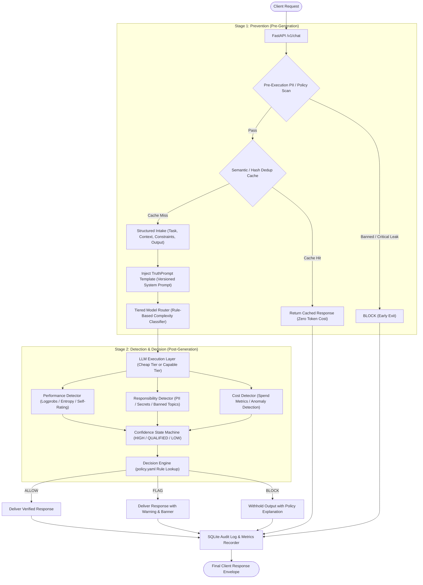
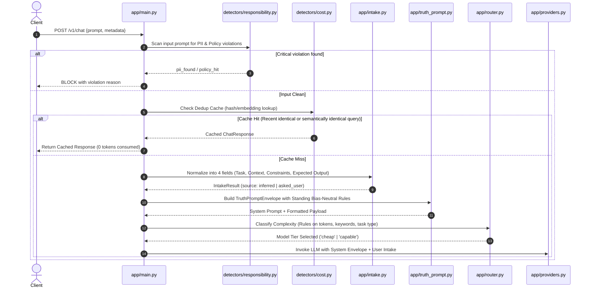
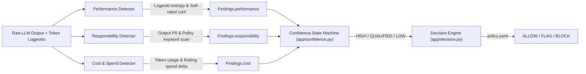
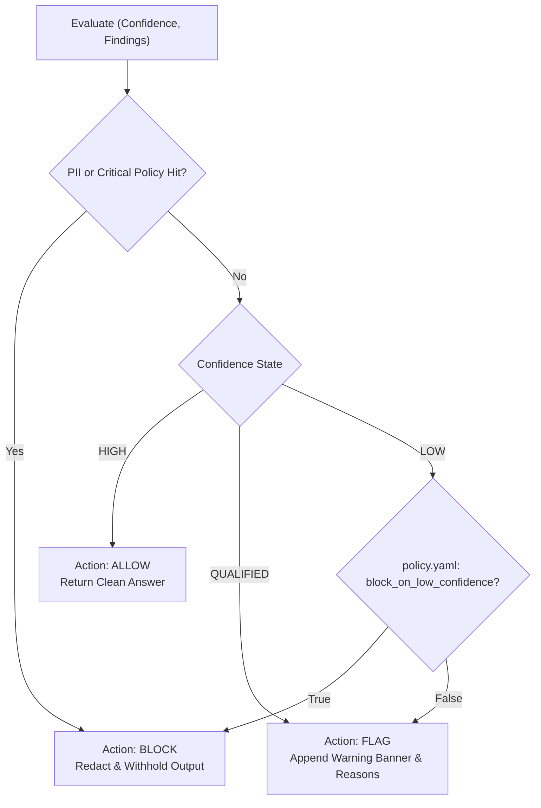

# ControlPlane Wrapper — End-to-End Pipeline Specification (`pipeline.md`)

This document provides a comprehensive technical specification of the ControlPlane execution pipeline, detailing data flow, stage contracts, verification mechanisms, and deterministic decision logic.

---

## 1. Executive Pipeline Architecture

ControlPlane acts as a **deterministic, non-invasive orchestration proxy** between client applications and downstream Large Language Model (LLM) providers. It operates in two main sequential stages: **Stage 1 (Prevention)** and **Stage 2 (Detection & Decision)**.



---

## 2. Stage-by-Stage Breakdown

### Stage 1: Prevention (Before Generation)

The goal of Prevention is to catch ambiguous requests, cost waste, duplicate executions, and policy leaks **before** consuming expensive model tokens.



#### 1. Pre-execution Scan (`detectors/responsibility.py`)
- Fast regex and keyword inspection of inbound prompt.
- Prevents leaking secrets or executing explicitly prohibited prompts.

#### 2. Dedup Interception (`detectors/cost.py`)
- Request hashing and semantic similarity matching against recent executions stored in SQLite.
- If match exceeds similarity threshold (e.g. cosine ≥ 0.95 or exact normalized SHA256 match), cached output is returned immediately.

#### 3. Structured 4-Question Intake (`intake.py`)
- Normalizes raw prompt into:
  - **Task**: The core action requested.
  - **Context**: Domain background, inputs, or entities.
  - **Constraints**: Format limitations, length limits, forbidden tools.
  - **Expected Output**: Specific return format (e.g., JSON, markdown list, code block).
- **Resolution Strategy**:
  - *Heuristic Inference*: Fast rule-based keyword/regex parsing (0 extra tokens).
  - *Targeted Clarification*: Returns a single clarification question if genuinely ambiguous.

#### 4. TruthPrompt System Envelope (`truth_prompt.py`)
- Injects standardized instructions enforcing:
  1. Systematic decomposition of problem.
  2. Strict segregation of verified facts vs. assumptions/inferences.
  3. Output self-verification step.
  4. Self-reported confidence score (0.0 – 1.0).
  5. Built-in bias-neutral standing instructions.

#### 5. Tiered Model Router (`router.py`)
- Rule-based classifier mapping requests without using an LLM call:
  - **Cheap Tier** (e.g., `gpt-3.5-turbo`, `gemini-1.5-flash`): Simple summaries, extraction, formatting, standard Q&A.
  - **Capable Tier** (e.g., `gpt-4o`, `gemini-1.5-pro`): Complex multi-step reasoning, mathematical derivations, policy-sensitive tasks, or explicit user override.

---

### Stage 2: Detection & Decision (After Generation)

Post-generation, the candidate response undergoes parallel inspection by three specialized detectors.



#### 1. Performance Detection (`detectors/performance.py`)
- Evaluates token-level log probabilities and sequence entropy if available from the provider.
- Falls back to parsing self-reported confidence from TruthPrompt output schema if logprobs are unavailable.
- Computes `performance_score` and flags low-confidence token clusters.

#### 2. Responsibility Detection (`detectors/responsibility.py`)
- Scans candidate answer for PII leakage (emails, phone numbers, SSNs, credit cards, API keys).
- Matches against banned corporate policy keywords or restricted topics configured in `policy.yaml`.

#### 3. Cost & Spend Anomaly Detection (`detectors/cost.py`)
- Computes exact token cost (prompt tokens + completion tokens × model pricing).
- Updates rolling 1-hour and 24-hour spend window in SQLite.
- Flags anomaly if current request cost or rolling velocity deviates significantly from baseline.

---

## 3. Confidence State Machine & Decision Engine

Confidence is strictly **evidence-based**, never determined by tone or fluently asserted prose.

### Confidence State Transitions

| State | Conditions |
|---|---|
| **HIGH** | `performance_score` ≥ 0.80 (or self_rated ≥ 0.85), 0 PII entities, 0 policy hits, no spend anomaly. |
| **QUALIFIED** | `performance_score` between 0.50 and 0.79, minor non-sensitive policy warnings, or missing token logprobs with moderate self-rated score. |
| **LOW** | `performance_score` < 0.50, high token entropy, unverified factual claims, or detected data anomalies. |

### Decision Mapping (`app/decision.py` via `policy.yaml`)



---

## 4. Data Contracts & Schema Reference

```python
# app/core_types.py

class IntakeResult(BaseModel):
    task: str
    context: str
    constraints: str
    expected_output: str
    source: Literal["inferred", "asked_user"]

class DetectionFindings(BaseModel):
    performance_score: Optional[float] = None
    self_rated_confidence: Optional[float] = None
    is_duplicate: bool = False
    spend_anomaly: bool = False
    pii_found: List[str] = Field(default_factory=list)
    policy_hits: List[str] = Field(default_factory=list)

class ConfidenceResult(BaseModel):
    state: Literal["HIGH", "QUALIFIED", "LOW"]
    reasons: List[str]

class Decision(BaseModel):
    action: Literal["ALLOW", "FLAG", "BLOCK"]
    reasons: List[str]
    warning_banner: Optional[str] = None

class ChatResponse(BaseModel):
    request_id: str
    model_used: str
    tier: Literal["cheap", "capable"]
    intake: IntakeResult
    findings: DetectionFindings
    confidence: ConfidenceResult
    decision: Decision
    content: Optional[str]
    cached: bool = False
    latency_ms: float
```

---

## 5. Persistence & Audit Logging (`app/db.py`)

Every single execution (allowed, flagged, blocked, or cached) writes a non-blocking trace record to SQLite:
- `request_id`, `timestamp`
- `raw_prompt`, `normalized_intake`
- `truth_prompt_version`
- `model_tier`, `provider_latency`
- `token_usage` (input, output, estimated cost)
- `detection_findings_json`
- `confidence_state`, `decision_action`
- `audit_reasons`

This enables complete post-hoc explainability: given any answer, engineers can instantly inspect the exact decision path and detector scores that authorized or flagged it.
