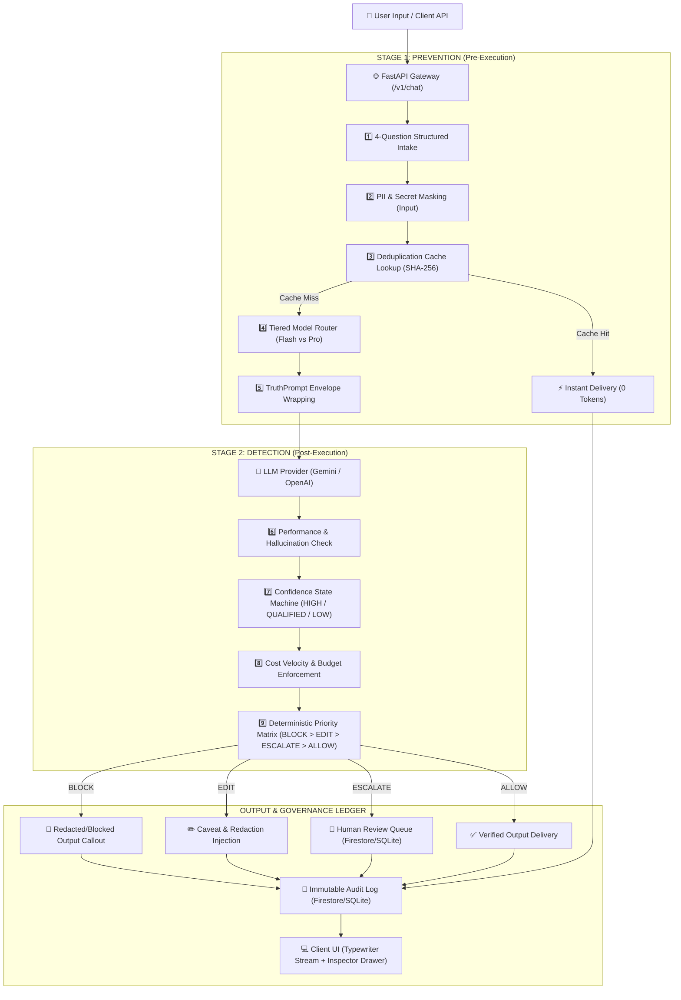

# ControlPlane — End-to-End Prompt Lifecycle & Architecture Workflow

```
   ┌─────────────────────────────────────────────────────────────────────────┐
   │                        ControlPlane AI Governance                       │
   │               Deterministic Two-Stage Proxy Architecture                │
   └─────────────────────────────────────────────────────────────────────────┘
```

This document provides a comprehensive, end-to-end walkthrough of how a prompt travels through **ControlPlane**: from user input in the browser, through deterministic intake and prevention rules, down into model routing and truth envelope evaluation, through post-generation safety checks and confidence scoring, to immutable audit logging and final delivery.

---

## 1. High-Level Architecture Overview

ControlPlane operates as an intelligent, deterministic proxy layer sitting between your client applications and large language model (LLM) providers (Google Gemini, OpenAI).



---

## 2. End-to-End Step-by-Step Prompt Lifecycle

### Step 1: Client Ingestion & Topic Shift Detection
- **Source**: `app/static/app.js` & `app/static/index.html`
- When a user enters a query in the chat input or an external API calls `POST /v1/chat`:
  1. **Topic Shift Analysis**: `app.js` checks the keyword intersection between the current prompt and the previous conversation history. If semantic similarity is low (`< 0.20`), a floating modal offers the user an option to start a fresh chat to save context tokens.
  2. **Payload Dispatch**: Dispatches JSON `{ "prompt": "...", "user_id": "...", "model_override": null }` to the backend.

---

### Step 2: Stage 1 Prevention — 4-Question Intake & Input Sanitization
- **Source**: `app/truth_prompt.py` & `app/decision.py`
- Before any LLM is called, the prompt undergoes deterministic intake decomposition:
  1. **Task Extraction**: Identifies the primary core instruction.
  2. **Context Identification**: Discovers explicit domain bounds.
  3. **Constraints Parsing**: Identifies formatting rules, language requirements, or length limits.
  4. **Expected Output Structure**: Determines whether code, JSON, math proof, or markdown is expected.
  5. **Stage 1 Input Redaction**: Scans input for sensitive patterns (SSNs, credit card numbers, passwords, Bearer tokens, OpenAI/AWS API keys) using regex patterns defined in `app/decision.py`.

---

### Step 3: Zero-Token Deduplication Cache Interception
- **Source**: `app/db.py`
- ControlPlane computes a SHA-256 hash of the normalized prompt string + system configuration:
  $$\text{CacheKey} = \text{SHA256}(\text{NormalizedPrompt} \parallel \text{TruthPromptEnvelope})$$
- If an exact verified entry exists in the `dedup_cache` database table:
  - **Latency**: `< 15ms`
  - **Tokens Consumed**: `0 tokens`
  - **Cost**: `$0.00000 USD`
  - The cached verified response is returned immediately to the user with `cached: true`.

---

### Step 4: Tiered Model Routing (Cost Optimization)
- **Source**: `app/decision.py`
- If cache misses, the query is routed to the optimal price-performance model tier:
  - **Cheap Tier** (`gemini-flash-lite-latest` / `gpt-3.5-turbo`):
    - Default for conversational queries, code syntax lookups, and general Q&A (`< 1,200` characters without formal reasoning triggers).
    - Cost: `~$0.00005 per 1k tokens`.
  - **Capable Tier** (`gemini-3.1-pro` / `gpt-4o`):
    - Auto-routed when formal proof or complex reasoning triggers are detected (e.g., *"step-by-step mathematical proof"*, *"formal verification"*, *"security vulnerability audit"*, *"complex regex engine"*).
    - Or if explicitly requested via user dropdown override.

---

### Step 5: TruthPrompt Envelope Wrapping & LLM Dispatch
- **Source**: `app/truth_prompt.py` & `app/providers.py`
- ControlPlane wraps the sanitized user prompt inside the **TruthPrompt Envelope (`truth_prompt_v1`)**:
  ```markdown
  [TRUTHPROMPT ENVELOPE V1]
  INSTRUCTIONS FOR DETERMINISTIC ACCURACY:
  1. Explicitly separate Facts from Assumptions and Inferences.
  2. If certain elements are ambiguous, state exact conditions.
  3. Append Confidence Level (0.0 to 1.0) and Key Caveats at the end.
  
  [INTAKE]
  TASK: <Extracted Task>
  CONTEXT: <Extracted Context>
  CONSTRAINTS: <Extracted Constraints>
  EXPECTED OUTPUT: <Output Format>
  
  [USER PROMPT]
  <Sanitized User Prompt>
  ```
- The wrapped prompt is sent to the LLM via `GoogleGeminiProvider` or `OpenAIProvider`.

---

### Step 6: Stage 2 Detection — Post-Execution Safety & Guardrails
- **Source**: `app/decision.py`
- Once the raw model completion arrives, ControlPlane evaluates 4 post-generation detection checks:
  1. **Performance Check**: Compares generation length, stop sequence integrity, and self-rated confidence score against accuracy thresholds.
  2. **Stage 2 Output Redaction**: Scans model output for accidental secret or PII leakage, replacing matches deterministically with `[REDACTED_{ENTITY}]`.
  3. **Confidence State Machine Evaluation**:
     - **`HIGH`** ($\ge 0.85$): Verified factual consensus without severe caveats.
     - **`QUALIFIED`** ($0.60 \le \text{Score} < 0.85$): High-quality response containing valid scientific or existential caveats.
     - **`LOW`** ($< 0.60$): Hallucination risks, conflicting claims, or low model certainty.
     - **`UNKNOWN`**: Missing confidence indicators.
  4. **Cost & Velocity Limit Tracking**: Calculates exact input/output tokens and incremental USD spend against the hourly limit ($10.00/hr).

---

### Step 7: Deterministic Action Matrix Resolution
- **Source**: `app/decision.py`
- Applies strict priority ordering (`BLOCK` > `EDIT` > `ESCALATE` > `ALLOW`):

| Priority | Action | Trigger Conditions | Result to User |
| :--- | :--- | :--- | :--- |
| **1. HIGHEST** | **`BLOCK`** | Severe safety violations, prohibited queries, hard budget overruns ($10/hr exceeded). | Returns warning callout; blocks model text. |
| **2. HIGH** | **`EDIT`** | PII / Secrets detected, missing crucial caveats. | Masks PII with `[REDACTED]` tokens and injects caveats. |
| **3. MEDIUM** | **`ESCALATE`** | Confidence is `LOW`, or ambiguous intent. | Queues response for operator audit in **Review Queue**; returns answer with caution banner. |
| **4. STANDARD** | **`ALLOW`** | Confidence is `HIGH` or `QUALIFIED`, all guardrails pass. | Direct verified delivery. |

---

### Step 8: Human-in-the-Loop (HITL) Review Queue Insertion
- **Source**: `app/db.py` & `app/main.py`
- If the action is `ESCALATE` (or confidence is `LOW`):
  - A review record is stored in the database with status `pending`.
  - The sidebar badge count updates in real-time.
  - Human operators can review, inspect model reasoning, and 1-click **Approve** or **Reject & Block** at `/v1/reviews`.

---

### Step 9: Immutable Audit Logging & Telemetry
- **Source**: `app/db.py`
- Every single request writes an immutable audit trace entry containing:
  - `request_id`: Unique UUIDv4 identifier.
  - `prompt`: Normalized prompt text.
  - `decision_action`: `ALLOW`, `EDIT`, `ESCALATE`, or `BLOCK`.
  - `confidence_state`: `HIGH`, `QUALIFIED`, `LOW`, `UNKNOWN`.
  - `tier`: `cheap` vs `capable`.
  - `model_used`: Exact LLM version string.
  - `tokens_used`: Total tokens billed.
  - `estimated_cost_usd`: Exact dollar cost.
  - `latency_ms`: Complete round-trip pipeline latency.
  - `cached`: Boolean indicating whether dedup cache was hit.

---

### Step 10: Client Delivery & Live Reasoning Inspector
- **Source**: `app/static/app.js`
- The client receives the clean JSON response:
  1. **Fluid Typewriter Streaming**: Renders the core answer word-by-word with code block formatting and copy buttons.
  2. **TruthPrompt Verification Drawer**: If caveats exist, packages them cleanly into a structured Verification Summary box.
  3. **Live Reasoning Inspector Drawer**: Clicking **"Inspect Reasoning"** slides out a 4-tab panel detailing:
     - **Summary Tab**: Decision state, model tier, token economics, deterministic reasons.
     - **Stage 1 Tab**: 4-question intake breakdown and TruthPrompt envelope structure.
     - **Stage 2 Tab**: Performance score, redaction results, confidence evaluation.
     - **Raw JSON Tab**: Complete machine-readable audit payload.

---

## 3. Database Architecture: Hybrid Cloud Adapter

ControlPlane features an automatic hybrid storage layer in [`app/db.py`](file:///Users/galanijenil/Documents/team%20innova/ControlPlane/app/db.py):

```
                       ┌────────────────────────┐
                       │   Database Adapter     │
                       │     (app/db.py)        │
                       └───────────┬────────────┘
                                   │
                    ┌──────────────┴──────────────┐
                    ▼                             ▼
       [When USE_FIRESTORE=true]       [Default Local Offline]
      ┌─────────────────────────┐     ┌─────────────────────────┐
      │   Google Cloud          │     │   Zero-Ops SQLite       │
      │   Firestore Database    │     │   controlplane.db       │
      │  (Persistent Cloud Hub) │     │   (Zero-Ops Local File) │
      └─────────────────────────┘     └─────────────────────────┘
```

- **Firestore Collections**: `audit_logs`, `dedup_cache`, `spend_records`, `review_queue`.
- **Zero Configuration**: Automatically enabled when Firebase credentials or environment variables are present; gracefully falls back to local SQLite with identical schemas.

---

## 4. Key Component Map

| File | Purpose / Role |
| :--- | :--- |
| [`app/main.py`](file:///Users/galanijenil/Documents/team%20innova/ControlPlane/app/main.py) | FastAPI Gateway, endpoint handlers (`/v1/chat`, `/v1/audit/logs`, `/v1/reviews`, `/health`), CORS configuration. |
| [`app/truth_prompt.py`](file:///Users/galanijenil/Documents/team%20innova/ControlPlane/app/truth_prompt.py) | Stage 1 4-question structured intake engine and TruthPrompt envelope formulation. |
| [`app/decision.py`](file:///Users/galanijenil/Documents/team%20innova/ControlPlane/app/decision.py) | Tiered router, PII/Secret regex patterns, Confidence state machine, and Deterministic priority matrix. |
| [`app/providers.py`](file:///Users/galanijenil/Documents/team%20innova/ControlPlane/app/providers.py) | LLM provider wrappers for Google Gemini and OpenAI. |
| [`app/db.py`](file:///Users/galanijenil/Documents/team%20innova/ControlPlane/app/db.py) | Hybrid database manager (Cloud Firestore + Local SQLite) for audit traces, spend tracking, and review queue. |
| [`app/static/index.html`](file:///Users/galanijenil/Documents/team%20innova/ControlPlane/app/static/index.html) | Centered, minimalist SPA interface (Chat Playground, Audit Traces, Review Queue, Policy & Guardrails). |
| [`app/static/style.css`](file:///Users/galanijenil/Documents/team%20innova/ControlPlane/app/static/style.css) | Dark obsidian design system with slate elevation shadows and CP monogram branding. |
| [`app/static/app.js`](file:///Users/galanijenil/Documents/team%20innova/ControlPlane/app/static/app.js) | Frontend interactive client logic, typewriter streaming, topic shift detection, and live reasoning inspector. |

---

## 5. Running the Application

### Local Development Server:
```bash
uvicorn app.main:app --reload --host 0.0.0.0 --port 8000
```

### Global HTTPS Access (Cloudflare Tunnel):
```bash
cloudflared tunnel --url http://localhost:8000
```

### Deploy Web UI to Firebase Hosting:
```bash
firebase deploy --only hosting --project controlplaneai
```
